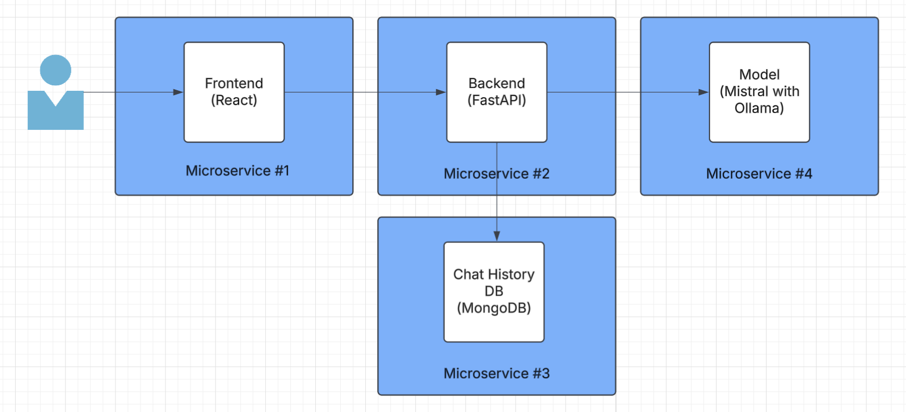

# ScalableChatbot

## Overview
In this project, I designed, implemented, and deployed a chatbot app powered by Mistral AI capable of supporting 10,000+ users -- check it out here: http://34.56.233.16/

## Core Functionality
This chatbot allows users to have independent conversations with the chatbot, maintaining each user's conversation history for context. 

## System Architecture

I chose a microservice architecture over a monolithic approach for several reasons:

- Different services require varying amounts of bandwidth, allowing for more flexible scaling.
- A failure in one service won't bring down the entire system.
- Microservices enable more cost-effective scaling at larger volumes.
- Simple integration for future services (mobile frontend, response caching, database queue, authentication, etc.)

Each of these reasons is discussed in more detail in the following sections.

Each microservice is Dockerized and deployed using Google Kubernetes Engine (GKE), managed by Kubernetes. A Google Cloud HTTP(S) Load Balancer sits at the front, distributing incoming traffic and ensuring high availability. In my kubernetes cluster, each microservice is a separate pod with independent scaling configurations. Microservices communicate with each other over HTTP, as each load balancer has an exposed port.  

### Chat History Database
The database is built using MongoDB, a NoSQL database, instead of a traditional SQL-based solution. MongoDB was chosen for its scalability and ability to handle large volumes of unstructured data efficiently. Unlike relational databases, which require predefined schemas, MongoDB’s flexible document-based model allows us to store chat messages dynamically while maintaining high performance. 

In the system, each user has their own document indexed by username and each question-response query gets appended to the user's document. This allows for fast retrievals of entire chat histories (O(1)) and separates data for each user to reduce read-write bottlenecks with many concurrent users. 

To estimate storage, I assume the following: 

Average message size: 200 bytes (including text and metadata)
Average messages per user per day: 50
Retention period: 1 year (365 days)

Based on these assumptions:

Per user per day:
50 messages × 200 bytes = 10 KB
Per user per year:
10 KB × 365 days = 3.65 MB
For 10,000 users:
10,000 × 3.65 MB = 36.5 GB per year

Since this isn't that much, I can sufficiently handle this with only one pod with a persistent volume. However, if needed in the future for many more users, MongoDB allows for a replica set architecture with primary nodes and multiple secondaries, handing data retrieval and indexing efficiently. I would also configure sticky sessions for the load balancer, making sure that the user's data isn't written across multiple databases during their session.  

### Model
I chose Mistral for its high performance and light weight for pod functionality. Ollama is used for efficient model deployment, giving me an easy-to-use base docker image for my service. With it's built-in functionality, I easily communicate with this service using its REST API. To ensure a consistent user experience, I've implemented sticky sessions with a load balancer, maintaining context across the entire session.

### Backend
For my backend, I chose FastAPI for it's simplicity and low latency. I use Uvicorn to run the application, and I configured CORS to allow communication between the frontend and backend, ensuring smooth, secure interactions across different services.

### Frontend
For my frontend, I used a React + Vite setup for it's simplicity for deployment. I created an axios instance for the base URL, and use that base for each of the requests I send. For storing the username, I chose to keep it in a cookie for the session and send over the username to the backend in a header of each request, reducing risk of exposing sensitive information in the URL. This also makes it easier to scale the application because the load balancers can route requests to different backend pods without losing context. 

## Scalability
To ensure scalability, I am using GKE's horizontal pod autoscaler that automatically scales the number of replicas based on CPU utilization. As the system experiences more load, the autoscaler increases the number of replicas to maintain performance. Load balancers efficiently distribute traffic across replicas, improving reliability and preventing any single instance from being overwhelmed. However, this system introduces problems like pod startup delay and load balancer exhaustion, so it's also necessary to monitor performance closely and ensure that pods are only considered "healthy" once they are fully ready to handle traffic. Also, sticky sessions, which maintain user context across requests, could potentially be exploited by rogue users, so it's essential to limit message frequency to prevent abuse. Currently, I run services with a max of 5 replicas and scaling happens at 80% CPU utilization, though further testing is needed to assess how well the system performs under heavy traffic.

## Reliability
For reliability, I rely on Kubernetes' pod management features, such as replicas and health checks, to ensure that my microservices remain available and responsive even during failures. Horizontal autoscaling helps to maintain service quality during high traffic or resource-intensive periods. Additionally, I leverage Kubernetes' self-healing mechanisms, where pods are automatically restarted if they fail, ensuring minimal downtime and consistent service performance. For the database, I store data in a persistent volume, ensuring that even if the service fails or a pod is restarted, the data remains intact and accessible. 

## Cost Considerations
Right now, I'm using a standard GKE cluster with no GPU which costs only $0.10 per hour, but perhaps doesn't perform as ideally as users would like. For a scalable architecture, this remains affordable because this is the cost for the entire cluster as long as I keep scaling within 150,000 pods, more than enough for 10,000 users. In the future, I plan to implement caching to limit the most resource-intensive part of the pipeline, and that should reduce costs if I chose to pivot to more better server hardware. 

## Issues and Future Improvements
As you can see with the app, the latency can sometimes be incredibly long in spite of my scaling measures -- the pods themselves don't have much compute power, meaning ollama queries sometimes take a few minutes to recieve a response. I was running into many issues with my ollama pods exceeding RAM limits and crashing, leading me to believe that if lower latency is desired, as should be for such an application, better hardware is necessary for deployment. Also, though I keep context for each user, I found out late in my project building process that prompting with context was deprecated with ollama, so I need to switch to a different model setup. 

Also, because of my modular system, I hope to add new services in the future, including user authentication, common response caching, and a queue to synchronize database writes. 

